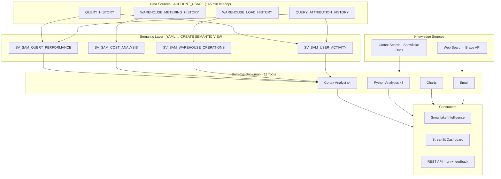

# Sam-the-Snowman

> DEMONSTRATION PROJECT - EXPIRES: 2026-04-18
> This demo uses Snowflake features current as of March 2026.

Snowflake Intelligence agent for query performance, cost optimization, and warehouse operations -- with 11 tools including Cortex Analyst, Cortex Search, web search, Python analytics, email delivery, and charting.

**Pair-programmed by:** SE Community + Cortex Code
**Created:** 2025-11-25 | **Expires:** 2026-04-18 | **Version:** 9.0 | **Status:** ACTIVE

## Brand New to GitHub or Cortex Code?

Start with the [Getting Started Guide](../guide-coco-setup/) -- it walks you through downloading the code and installing Cortex Code (the AI assistant that will help you with everything else).

## First Time Here?

1. **Deploy** -- Copy `deploy_all.sql` into Snowsight, click "Run All" (~3-5 min)
2. **Use** -- Navigate to AI & ML > Agents > Sam-the-Snowman
3. **Test** -- `CALL SNOWFLAKE_EXAMPLE.SAM_THE_SNOWMAN.SP_RUN_TESTS();`
4. **Cleanup** -- Run `sql/99_cleanup/teardown_all.sql` when done

**Estimated cost:** ~0.10 credits (~$0.20) + <1 GB storage

## Development Tools

This project is designed for AI-pair development.

- **AGENTS.md** -- Project instructions for Cortex Code and compatible AI tools
- **.claude/skills/** -- Project-specific AI skill teaching the AI this project's patterns
- **Cortex Code in Snowsight** -- Open in a Workspace for AI-assisted development
- **Cortex Code CLI** -- `cortex -w /path/to/Sam-the-Snowman`
- **Cursor** -- Open locally for AI-pair coding

> New to AI-pair development? See [Cortex Code docs](https://docs.snowflake.com/en/user-guide/cortex-code/cortex-code)

## What Sam Demonstrates

| Feature | Implementation |
|---------|---------------|
| **Cortex Analyst** | 4 semantic views with relationships, TIME_DIMENSIONS, metrics, filters, VQRs |
| **Cortex Search** | Snowflake documentation search with `columns_and_descriptions` (GA March 2026) |
| **Web Search** | Live web results via Brave Search API for recent features and community content |
| **Agent Evaluations** | Evaluation dataset + config with answer_correctness, logical_consistency, custom metric |
| **System Instructions** | Dedicated `system` field for persona/guardrails, `response` for formatting |
| **Standard SQL on SVs** | `SELECT ... FROM semantic_view GROUP BY` (GA March 2026) |
| **Python Analytics** | Anomaly detection, efficiency scoring, trend analysis via Snowpark |
| **Agent PROFILE** | `display_name` + `color` for branded Snowflake Intelligence UI |
| **Automated Testing** | SMOKE, FUNCTIONAL, REGRESSION, PERFORMANCE tests with stored procedure |
| **REST API** | `sam_agent_run.sh` with `:run` and `:feedback` endpoints |

## Architecture

## Snowflake Objects

| Object | Location |
|--------|----------|
| Agent | `SNOWFLAKE_EXAMPLE.SAM_THE_SNOWMAN.SAM_THE_SNOWMAN` |
| Semantic views | `SNOWFLAKE_EXAMPLE.SEMANTIC_MODELS.SV_SAM_*` (4 views) |
| Python procedures | `SNOWFLAKE_EXAMPLE.SAM_THE_SNOWMAN.SP_SAM_*` (3 procs) |
| Test framework | `SNOWFLAKE_EXAMPLE.SAM_THE_SNOWMAN.SP_RUN_TESTS()` |
| Email procedure | `SNOWFLAKE_EXAMPLE.SAM_THE_SNOWMAN.SFE_SEND_EMAIL()` |
| Evaluation data | `SNOWFLAKE_EXAMPLE.SAM_THE_SNOWMAN.SAM_EVALUATION_DATA` |
| Dashboard | `SNOWFLAKE_EXAMPLE.SAM_THE_SNOWMAN.SAMS_DASHBOARD` |
| Warehouse | `SFE_SAM_SNOWMAN_WH` (X-Small, auto-suspend 60s) |

All objects have `COMMENT = 'DEMO: ... (Expires: 2026-04-18)'`.

---

**Pair-programmed by:** SE Community + Cortex Code | **License:** Apache 2.0
