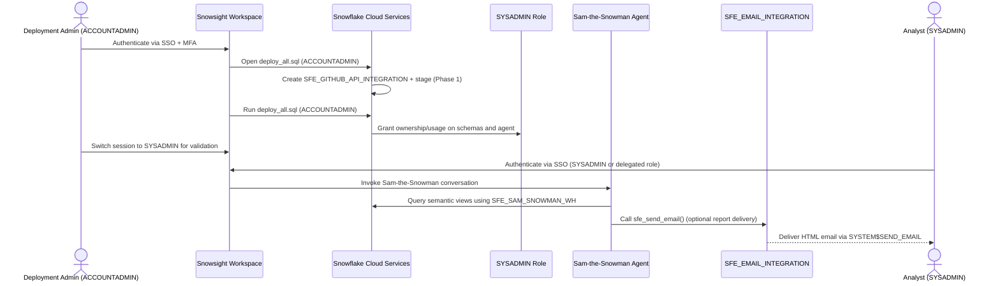

# Auth Flow - Sam-the-Snowman

Author: SE Community  
Last Updated: 2025-12-16  
Expires: 2026-01-15 (30 days from creation)  
Status: Reference Implementation

> **Reference Implementation:** This code demonstrates production-grade architectural patterns and best practices. Review and customize security, networking, and logic for your organization's specific requirements before deployment.

## Overview
This sequence diagram shows how ACCOUNTADMIN provisions the demo, how SYSADMIN owns runtime assets, and how analysts authenticate to use the agent. RBAC gates every stage, no secrets are stored in code, and email delivery relies on Snowflake-managed credentials.

## Diagram

## Component Descriptions
- **Deployment Admin (ACCOUNTADMIN)**
  - Purpose: Provision integrations, databases, warehouse, and agent resources.
  - Technology: Snowsight worksheet running `deploy_all.sql`.
  - Location: Customer identity provider federated with Snowflake SSO.
  - Deps: Requires MFA and ACCOUNTADMIN role; the script auto-creates `SFE_SAM_SNOWMAN_WH`.
- **SYSADMIN Role**
  - Purpose: Owns demo schemas, semantic views, and the agent during steady state.
  - Technology: Snowflake RBAC role targeted inside each module.
  - Location: Snowflake account.
  - Deps: Receives `SNOWFLAKE.CORTEX_USER` database role plus `USAGE` on agent and schemas.
- **Sam-the-Snowman Agent**
  - Purpose: Orchestrate semantic analytics, documentation lookup, and email delivery.
  - Technology: Snowflake Intelligence Agent stored in `SNOWFLAKE_INTELLIGENCE.AGENTS`.
  - Location: Snowflake account.
  - Deps: Uses the dedicated warehouse `SFE_SAM_SNOWMAN_WH` plus permissions on semantic views/procedure.
- **SFE_EMAIL_INTEGRATION**
  - Purpose: Send optional emails without exposing SMTP credentials.
  - Technology: Snowflake notification integration invoked via `SYSTEM$SEND_EMAIL`.
  - Location: Snowflake control plane; usage granted to SYSADMIN.
  - Deps: Created with ACCOUNTADMIN privileges in `sql/02_email_integration.sql`.
- **Analysts (SYSADMIN or Delegated Role)**
  - Purpose: Day-to-day users who ask questions and receive recommendations.
  - Technology: Snowsight agent interface.
  - Location: Customer workforce authenticated through SSO.
  - Deps: Must assume a role with agent `USAGE`; the script ensures `SFE_SAM_SNOWMAN_WH` is available.

## Change History
See `.cursor/DIAGRAM_CHANGELOG.md` for version history.
