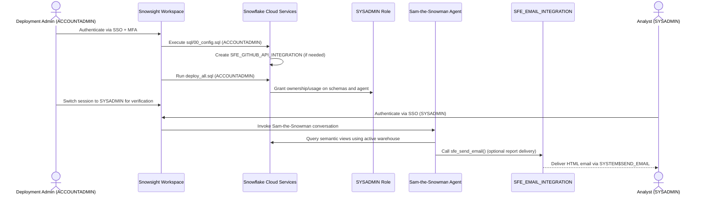

# Auth Flow - Sam-the-Snowman

**Author:** Michael Whitaker  
**Last Updated:** 2025-11-12  
**Status:** ⚠️ **DEMO/NON-PRODUCTION**

---

⚠️ **WARNING: This is a demonstration project. NOT FOR PRODUCTION USE.**

---

## Overview

This sequence outlines how administrators deploy Sam-the-Snowman and how analysts authenticate to use the agent. Roles are limited to ACCOUNTADMIN for provisioning and SYSADMIN (or a delegated role) for daily operations. Email integration leverages Snowflake-managed credentials; no secrets are stored in code.

---

## Diagram

---

## Component Descriptions

### Deployment Admin (ACCOUNTADMIN)
- **Purpose:** Provision integrations, databases, and agent artifacts.
- **Technology:** Snowsight worksheet with ACCOUNTADMIN role.
- **Location:** Customer identity provider integrated with Snowflake SSO.
- **Dependencies:** Must have MFA enabled and access to a compute warehouse.

### SYSADMIN Role
- **Purpose:** Owns demo schemas and executes agent conversations after deployment.
- **Technology:** Snowflake RBAC role granted by deployment scripts.
- **Location:** Snowflake account.
- **Dependencies:** Receives `USAGE` on the agent and databases; inherits `SNOWFLAKE.CORTEX_USER` database role.

### Sam-the-Snowman Agent
- **Purpose:** Respond to analyst questions by orchestrating semantic views, documentation search, and email delivery.
- **Technology:** Snowflake Intelligence Agent stored in `SNOWFLAKE_INTELLIGENCE.AGENTS`.
- **Location:** Snowflake account.
- **Dependencies:** Requires analysts to activate a warehouse before querying.

### SFE_EMAIL_INTEGRATION
- **Purpose:** Send optional recap emails without exposing credentials.
- **Technology:** Snowflake notification integration created with ACCOUNTADMIN.
- **Location:** Snowflake control plane.
- **Dependencies:** Called via `SYSTEM$SEND_EMAIL`; usage granted to SYSADMIN.

### Analysts (SYSADMIN)
- **Purpose:** Day-to-day users who ask questions and receive guidance.
- **Technology:** Snowsight agent interface.
- **Location:** Customer workforce authenticated via SSO.
- **Dependencies:** Must activate a warehouse and remain within granted RBAC scope.

---

## Change History

See `.cursor/docs/DIAGRAM_CHANGELOG.md` for version history.

