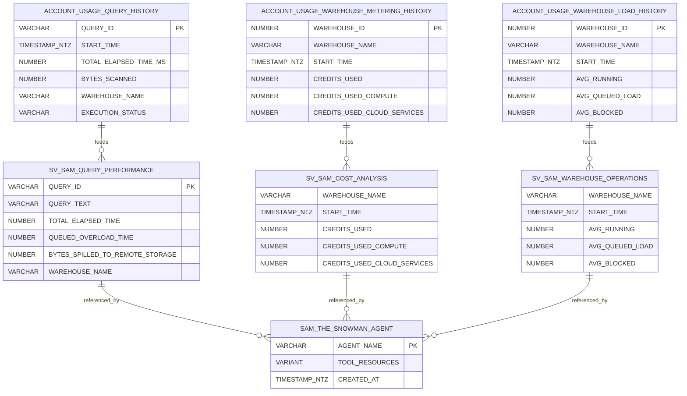

# Data Model - Sam-the-Snowman

Author: SE Community  
Last Updated: 2025-12-16  
Expires: 2026-01-15 (30 days from creation)  
Status: Reference Implementation

> **Reference Implementation:** This code demonstrates production-grade architectural patterns and best practices. Review and customize security, networking, and logic for your organization's specific requirements before deployment.

## Overview
The data model connects Snowflake telemetry (`SNOWFLAKE.ACCOUNT_USAGE`) to the semantic views in `SNOWFLAKE_EXAMPLE.SEMANTIC_MODELS`, which in turn power the Intelligence agent stored in `SNOWFLAKE_INTELLIGENCE.AGENTS`. All semantic views follow the `SV_SAM_*` prefix pattern for project identification.

## Diagram

## Component Descriptions
- **ACCOUNT_USAGE Source Tables**
  - Purpose: Capture authoritative telemetry for queries, warehouse spend, and capacity.
  - Technology: Snowflake-provided shared views inside `SNOWFLAKE.ACCOUNT_USAGE`.
  - Location: Snowflake control plane (read-only for customers).
  - Deps: Requires ACCOUNTADMIN-granted access; data drives every semantic view.
- **Semantic Views (SV_SAM_QUERY_PERFORMANCE / SV_SAM_COST_ANALYSIS / SV_SAM_WAREHOUSE_OPERATIONS)**
  - Purpose: Provide governed, LLM-friendly layers for Cortex tools.
  - Technology: Snowflake Semantic Views defined in `sql/03_semantic_views.sql`.
  - Location: `SNOWFLAKE_EXAMPLE.SEMANTIC_MODELS` schema (mandatory shared location).
  - Deps: Join to ACCOUNT_USAGE views and expose curated metrics plus synonyms.
- **Sam-the-Snowman Agent Catalog Entry**
  - Purpose: Persist agent instructions, tool bindings, and semantic view references.
  - Technology: Snowflake Intelligence Agent stored in `SNOWFLAKE_INTELLIGENCE.AGENTS`.
  - Location: `SNOWFLAKE_INTELLIGENCE.AGENTS.sam_the_snowman` (managed via Snowflake Intelligence object).
  - Deps: Relies on semantic views and procedure identifiers defined in `sql/05_agent.sql`.

## Change History
See `.cursor/DIAGRAM_CHANGELOG.md` for version history.
