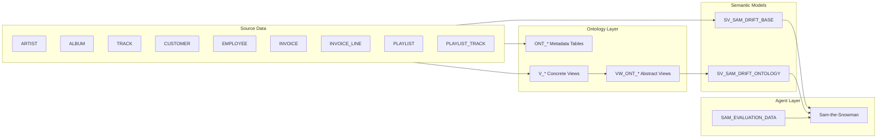

# Architecture Poster

## Flow Summary

1. Deterministic Drift data is loaded from repository-hosted Parquet files.
2. Ontology metadata and typed/abstract views model business concepts over source tables.
3. Two semantic views expose source-level and abstraction-level analytics paths.
4. Sam routes user questions across these tools and is evaluated on the same hard question set each run.
